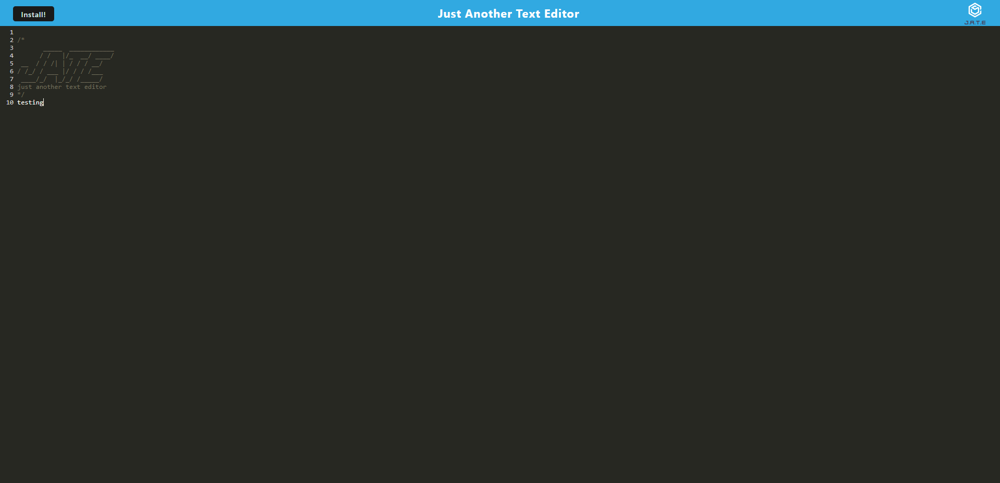

# PWA-Text Editior
 ## Description
  A simple application that allows you to save and edit text event when offline.

  

      
 ## Table of Contents 
 - [Description](#description)
 - [Installation](#installation)
 - [Usage](#usage)
 - [Contributions](#contributions)
 - [Tests](#tests)
 - [License](#license)
 - [Questions](#questions)

 ## Live App
 [PWA-Text Editor](https://stormy-sierra-66600.herokuapp.com/)

  ## Usage
  This app is used to edit text on and offline.

  ## Contributions
  Logan Schoerner

  ## Licenses
    This project is covered under the MIT license. Click the license button at the top to learn more about what this means.

  ## Questions
  Find me on GitHub at: [Logan2391](https://github.com/Logan2391) 
  Email me with questions regarding this application at: logan.schoerner@gmail.com